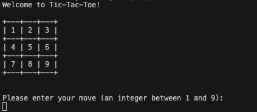
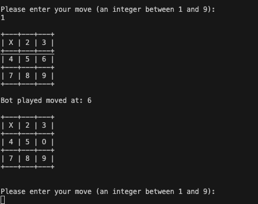
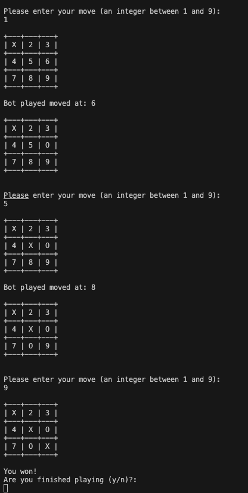

# Tic-Tac-Toe (Rust)
A Rustaceans Version of Tic-Tac-Toe!

All you need to do to run this package is:

```bash
cargo run
```

## How to Play (Example)
* Step 1: Enter the number (Position) you want to place your mark (X or O) on the board.
  

* Step 2: After you enter the number, the board will be updated with your mark. Also the computer will place its mark (O) on the board.



* Step 3: You can continue to play the game until you win or lose. If you win, you will see the following message.



* Step 4: If you want to quit, you just need to type "y" and press enter.
